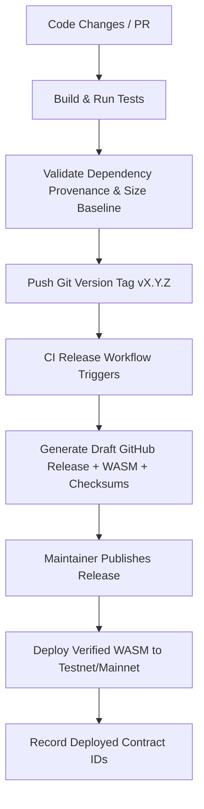

# Release Management and Versioning Strategy

This document outlines the release process, semantic versioning policy, and artifact verification guidelines for the Wrapped Pi (wPi) Soroban smart contracts.

---

## Semantic Versioning (SemVer)

Soroban contracts follow the standard [Semantic Versioning](https://semver.org/) guidelines to communicate the impact of code and storage updates to integration developers, node operators, and auditors.

For contract crates, version numbers are represented as `MAJOR.MINOR.PATCH`:

### MAJOR Bumps (Breaking Changes)
A `MAJOR` version bump is required when a change alters the contract interface or storage structure in a backward-incompatible way:
- **Interface breaking changes**: Modifying, renaming, or removing existing contract functions, changing parameter types, or altering returned types.
- **Storage breaking changes**: Altering state layout keys or values in `soroban-sdk` storage maps/keys that would corrupt or make existing on-chain contract state unreadable after an upgrade.
- **Behavioral breaking changes**: Restructuring permission layers, changing role invariants, or introducing strict requirements (such as pausing operations by default).

### MINOR Bumps (Backward-Compatible Features)
A `MINOR` version bump is used for backward-compatible functional additions:
- **New functions**: Adding new views or read-only/helper functions to the contract interface.
- **Optional/additional storage keys**: Storing non-critical information that does not impact or conflict with the core logic.
- **Optimization upgrades**: Refactoring logic internally to decrease WASM size or CPU instructions without modifying external interfaces or existing storage assumptions.

### PATCH Bumps (Fixes and Documentation)
A `PATCH` version bump is used for low-risk changes:
- **Bug fixes**: Fixing typos, safety checks, or edge-case logic bugs that do not alter the expected interface behavior.
- **Documentation updates**: Correcting comments, README files, or inline documentation.
- **Dependency bumps**: Upgrading underlying crates (e.g., patch level rust-sdk fixes) that do not break the contract.

---

## Release Lifecycle

The release cycle guarantees that all published contract binaries are reproducible, fully tested, audited, and traceable back to the exact state of the source repository.



### 1. Build and Test
Before initiating a release, verify that the workspace passes all compilation checks and tests:
```bash
make build
make test
```

### 2. Dependency Provenance and Size Verification
Ensure all dependencies are clean, uncompromised, and that target WASM files do not trigger regression alerts:
```bash
# Verify provenance
cd Stellar-contracts-v1
bash scripts/verify_dependency_provenance.sh

# Verify size baseline is updated
cd ..
bash scripts/update_wasm_baseline.sh
```

### 3. Generate Release Checksums
Calculate the checksums and collect compiler metadata for the release notes:
```bash
make checksum
```
This runs [`scripts/checksum_artifacts.sh`](../scripts/checksum_artifacts.sh) which outputs the SHA-256 hashes of compiled contracts, compiler versions, and source revisions.

### 4. Create and Push Tag
Tag the commit on the `main` branch with the semantic version prefix `v`:
```bash
git tag -a v0.1.0 -m "Release v0.1.0"
git push origin v0.1.0
```

### 5. Automated CI Publishing
The tag push automatically triggers the `.github/workflows/release.yml` pipeline. This pipeline compiles the release WASMs in a clean Ubuntu environment, computes the SHA-256 hashes, generates a `SHA256SUMS` file, and posts them as a draft GitHub Release.

### 6. Publish Release
A maintainer reviews the draft release on GitHub, completes the release description using the template below, and hits **Publish**.

### 7. Deploy & Record Deployed Contract IDs
Deploy the published WASM binaries to Stellar using the official deployment scripts and record the resulting contract IDs in the release notes.

---

## WASM Artifact Verification

To ensure security and auditability, third-party developers and users must be able to independently verify that the deployed on-chain contract bytecode exactly matches the open-source code under the specific release tag.

For every release, the following artifact details are recorded:
- **Contract filename**: e.g., `wpi_token.wasm`
- **SHA-256 checksum**: Unique hash of the compiled WASM binary.
- **Compiler version**: Exact version of `rustc` used to compile the WASM binary.
- **Build target**: Typically `wasm32-unknown-unknown`.
- **Source revision**: The specific Git commit SHA.

### Independent Verification Procedure

To verify a compiled WASM artifact manually:
1. Clone the repository and checkout the tag:
   ```bash
   git clone https://github.com/rohan911438/Wpi.git
   cd Wpi
   git checkout v0.1.0
   ```
2. Build the contracts using the identical toolchain specified in the release notes:
   ```bash
   make build
   ```
3. Generate the SHA-256 checksums of the compiled WASM files:
   ```bash
   make checksum
   ```
4. Verify that the generated SHA-256 checksum in `Stellar-contracts-v1/target/wasm32-unknown-unknown/release/SHA256SUMS` exactly matches the checksum published in the GitHub Release assets.

---

## GitHub Release Template

Maintainers must use the following template when creating or publishing a GitHub Release:

```markdown
# Release v[VERSION] ([DATE])

This release introduces [Brief summary of the changes in this version].

## Supported Networks
- Testnet: YES
- Mainnet: [NO / YES]

## Included Contracts
- `wpi-token` (v[VERSION])
- `mock-amm` (v[VERSION])

## Verification Metadata
- **Compiler Version**: `rustc 1.88.0 (2026-07-28)`
- **Build Target**: `wasm32-unknown-unknown`
- **Source Revision**: `[COMMIT_SHA]`

### SHA-256 Checksums
```text
[SHA-256-HASH]  wpi_token.wasm
[SHA-256-HASH]  mock_amm.wasm
```

## Deployment Info
- **Testnet Contract IDs**:
  - `wpi_token`: `[CONTRACT_ID_TESTNET]`
  - `mock_amm`: `[CONTRACT_ID_TESTNET]`
- **Mainnet Contract IDs**:
  - `wpi_token`: `[CONTRACT_ID_MAINNET]`

## Upgrade Notes
- [Upgrade instructions if applicable, e.g. state migrations or pause requirements]

## Known Limitations
- [Any outstanding issues or limitations]
```
